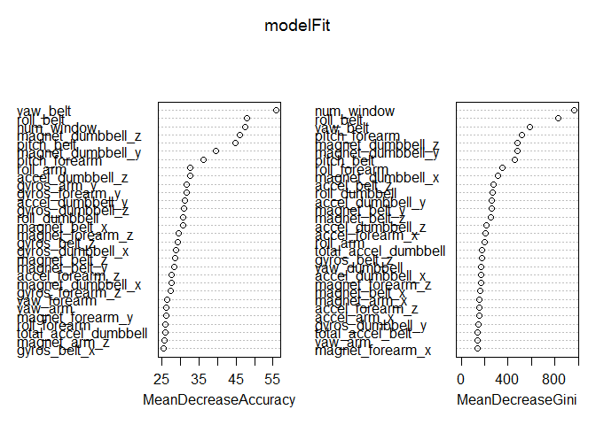

# Practical Machine Learning - Peer Assessments
Lakshmi Narayana  
Sunday, February 22, 2015  

  Report is created for Coursera Practical Machine Learning - Course Project .  
  
  The data for this project come from this source: [http://groupware.les.inf.puc-rio.br/har] and the data set used is Weight Lifting Exercise Dataset.  
  
## Goal of this Report

The goal of your project is to predict the manner in which they did the exercise. This is the "classe" variable in the training set. You may use any of the other variables to predict with. You should create a report describing how you built your model, how you used cross validation, what you think the expected out of sample error is, and why you made the choices you did. You will also use your prediction model to predict 20 different test cases. 

## Environment and libraries

Loading required libraries and setting the seed for reproducable results.


```r
library(knitr)
opts_chunk$set(echo = TRUE, results = 'hold')

# setInternet2 to TRUE to access https urls
setInternet2(TRUE)


library(ElemStatLearn)
library(caret)
library(rpart)
library(randomForest)

set.seed(1234)
```

## Data Processing

### Getting the Data

Reading the training [https://d396qusza40orc.cloudfront.net/predmachlearn/pml-training.csv] and testing [https://d396qusza40orc.cloudfront.net/predmachlearn/pml-testing.csv] data from the urls. 


```r
pml_training <- read.csv("http://d396qusza40orc.cloudfront.net/predmachlearn/pml-training.csv",header=TRUE,sep=",",na.strings=c("", "NA", " "))

pml_testing <- read.csv("https://d396qusza40orc.cloudfront.net/predmachlearn/pml-testing.csv",header=TRUE,sep=",",na.strings=c("", "NA", " "))

dim(pml_testing)
dim(pml_training)
```

```
## [1]  20 160
```

```
## [1] 19622   160
```

### Exploration & Cleaning the data

Identifying the columns with empty values and cleaning.

```r
na_training = sapply(pml_training, function(x) {sum(is.na(x))})
table(na_training)

na_testing = sapply(pml_testing, function(x) {sum(is.na(x))})
table(na_testing)
```

```
## na_training
##     0 19216 
##    60   100
```

```
## na_testing
##   0  20 
##  60 100
```

There are 60 features that have NA values for all the rows of the dataset and hence will be removed as the information does not improve the process of fitting the model.


```r
pml_training <- pml_training[, colSums(is.na(pml_training)) == 0]
pml_testing <- pml_testing[, colSums(is.na(pml_testing)) == 0]

dim(pml_training)
dim(pml_testing)
```

```
## [1] 19622    60
```

```
## [1] 20 60
```
Removing all columns that are not related. 


```r
pml_testing   <-  pml_testing[,c(7:60)]
pml_training   <-  pml_training[,c(7:60)]

dim(pml_training)
dim(pml_testing)
```

```
## [1] 19622    54
```

```
## [1] 20 54
```

Removin the column problem_ID

```r
pml_testing <- pml_testing[,-ncol(pml_testing)]

dim(pml_testing)
dim(pml_training)
```

```
## [1] 20 53
```

```
## [1] 19622    54
```


## Modeling

### Partitioning of the training data for training and validation

Partitioning of the training data into 70% training and 30% for validating.


```r
inTrain = createDataPartition(y=pml_training$classe, p=0.70, list=FALSE)
model_training = pml_training[inTrain,]
model_validation = pml_training[-inTrain,]
```

### Fitting into the model

In random forests, there is no need for cross-validation or a separate test set to get an unbiased estimate of the test set error. It is estimated internally, during the execution. So, we proced with the training the model (Random Forest) with the training data set.


```r
modelFit <- randomForest(classe~.,data=model_training,importance=TRUE)
modelFit
```

```
## 
## Call:
##  randomForest(formula = classe ~ ., data = model_training, importance = TRUE) 
##                Type of random forest: classification
##                      Number of trees: 500
## No. of variables tried at each split: 7
## 
##         OOB estimate of  error rate: 0.26%
## Confusion matrix:
##      A    B    C    D    E class.error
## A 3905    0    0    0    1    0.000256
## B    3 2652    3    0    0    0.002257
## C    0   10 2385    1    0    0.004591
## D    0    0   12 2239    1    0.005773
## E    0    0    0    5 2520    0.001980
```

### Cross Validation and Out of Sample Error


```r
varImpPlot(modelFit)
```

 

```r
confusionMatrix(predict(modelFit,newdata=model_validation[,-ncol(model_validation)]),model_validation$classe)

print(1- 0.998)
```

```
## Confusion Matrix and Statistics
## 
##           Reference
## Prediction    A    B    C    D    E
##          A 1674    3    0    0    0
##          B    0 1135    4    0    0
##          C    0    1 1020    4    0
##          D    0    0    2  960    0
##          E    0    0    0    0 1082
## 
## Overall Statistics
##                                         
##                Accuracy : 0.998         
##                  95% CI : (0.996, 0.999)
##     No Information Rate : 0.284         
##     P-Value [Acc > NIR] : <2e-16        
##                                         
##                   Kappa : 0.997         
##  Mcnemar's Test P-Value : NA            
## 
## Statistics by Class:
## 
##                      Class: A Class: B Class: C Class: D Class: E
## Sensitivity             1.000    0.996    0.994    0.996    1.000
## Specificity             0.999    0.999    0.999    1.000    1.000
## Pos Pred Value          0.998    0.996    0.995    0.998    1.000
## Neg Pred Value          1.000    0.999    0.999    0.999    1.000
## Prevalence              0.284    0.194    0.174    0.164    0.184
## Detection Rate          0.284    0.193    0.173    0.163    0.184
## Detection Prevalence    0.285    0.194    0.174    0.163    0.184
## Balanced Accuracy       1.000    0.998    0.997    0.998    1.000
```

```
## [1] 0.002
```
As evaluated the accuracy on the validation set is 99.8% and out of Sample Error is 1-accuracy which is 0.002  

## Model Evaluation with Test Data


```r
class_check <- (sapply(pml_testing, class) == sapply(pml_training[,-ncol(pml_training)], class))

pml_testing[, !class_check] <- sapply(pml_testing[, !class_check], as.numeric)


predictions <- predict(modelFit,pml_testing)
predictions
```

```
##  1  2  3  4  5  6  7  8  9 10 11 12 13 14 15 16 17 18 19 20 
##  B  A  B  A  A  E  D  B  A  A  B  C  B  A  E  E  A  B  B  B 
## Levels: A B C D E
```


## Generating Answers Files to Submit for Assignment.

```r
pml_write_files = function(x){
  n = length(x)
  for(i in 1:n){
    filename = paste0("./answers/problem_id_",i,".txt")
    write.table(x[i],file=filename,quote=FALSE,row.names=FALSE,col.names=FALSE)
  }
}

pml_write_files(predictions)
```

